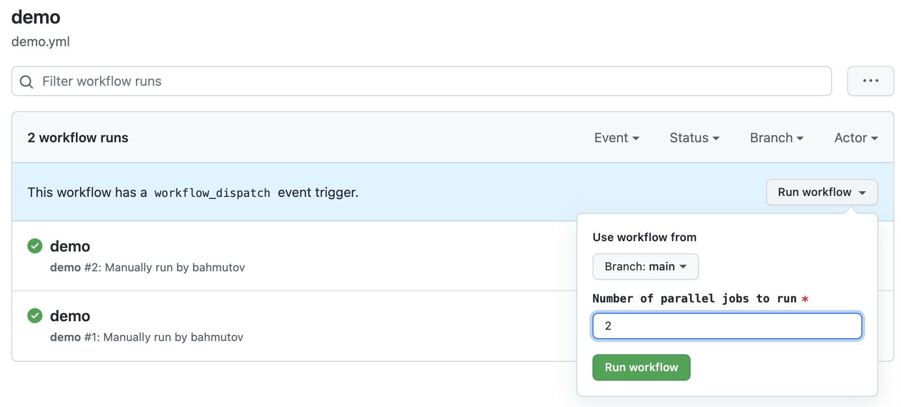
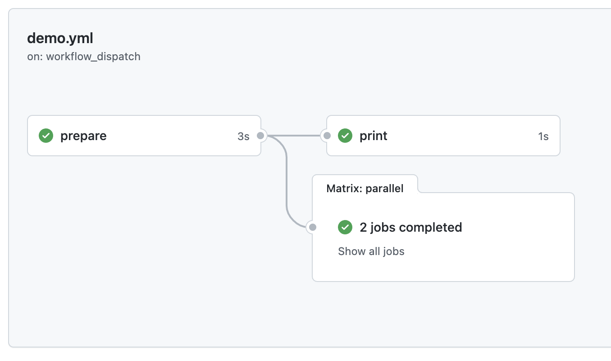

# gh-action-parameter
> Example running GitHub Actions using N machines where N is a user parameter

Look at the workflow [demo.yml](./.github/workflows/demo.yml) that you can trigger manually and pass the number of parallel jobs to create. It uses the script [output-matrix.sh](./output-matrix.sh) that generates container string like this:

```
{"containers":[1, 2, ...]}
```

Up to the number of machines you entered when triggering the workflow. For example, if you enter number 2



Then it will run two jobs in parallel after the `prepare` job generates such matrix strategy.



For more, read my blog posts about [GitHub Actions](https://glebbahmutov.com/blog/tags/github/).
